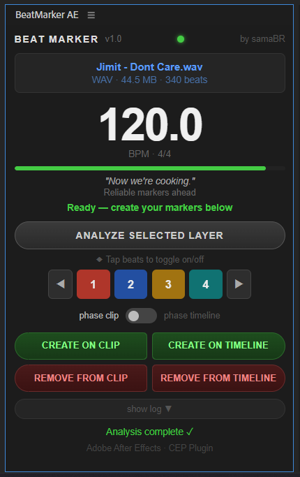
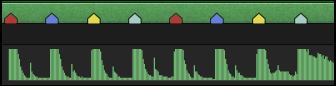

# BeatMarker AE

> Automatic beat detection and marker creation for Adobe After Effects.

BeatMarker AE analyzes the BPM of an audio layer and places colored markers on every beat — directly on the clip or on the composition timeline. Built as a CEP panel for After Effects 2026.

---

## Features

- **Automatic BPM detection** from WAV or MP3 audio layers
- **Colored markers** for each beat position in 4/4 time
  - Beat 1 → Red
  - Beat 2 → Blue
  - Beat 3 → Yellow
  - Beat 4 → Teal
- **Beat toggles** — enable or disable individual beats (1–4)
- **Phase shift** — shift the beat grid left or right without re-analyzing
- **Two marker targets**
  - *Create on Clip* — markers placed on the audio layer
  - *Create on Timeline* — markers placed on the composition (no interference with layer dragging)
- **Layer-position aware** — markers always start where the layer starts in the composition
- **Clean markers** — no text visible on the marker shield, color only
- **Confidence indicator** — Whiplash-themed phrases rating the reliability of the analysis
- **Bilingual UI** — Portuguese (pt-BR) and English, auto-detected from system language

---

## Screenshots

**Plugin panel**

**Beat markers on the After Effects timeline**

---

## Installation

See [INSTALL.md](INSTALL.md) for full instructions.

**Quick start (Windows, After Effects 2026):**
1. Download and extract the ZIP
2. Right-click `instalar.bat` → Run as Administrator
3. Restart After Effects
4. Open via **Window → Extensions → BeatMarker AE**

---

## Usage

1. Open a composition with an audio layer
2. Select the audio layer (or let the plugin find it automatically)
3. Click **Analyze Selected Layer**
4. Toggle which beats you want marked (1, 2, 3, 4)
5. Use **◀ ▶** to shift the beat phase if needed
6. Click **Create on Clip** or **Create on Timeline**

---

## Keyboard Shortcuts

After Effects native shortcuts that work with BeatMarker markers:

| Key | Action |
|-----|--------|
| `J` | Previous Marker |
| `K` | Next Marker |

---

## Compatibility

| Software | Version |
|---|---|
| Adobe After Effects | 2026 (v26.x) |
| OS | Windows 10 / 11 |
| Audio formats | WAV, MP3 |

> Mac support is not tested. CEP path may differ.

---

## Author

**samaBR** — [github.com/samaBR85](https://github.com/samaBR85)

---

## License

MIT
